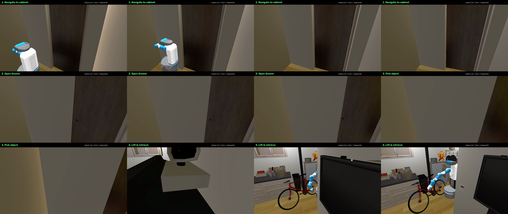

# Fetch Rearrange Demo — Portfolio Visualization

A scripted Habitat 2.0 visualization: the **Fetch** mobile manipulator navigates a
**ReplicaCAD** apartment (`apt_0`), **opens a drawer** of the chest-of-drawers, and
**picks up** a YCB object (master chef can).



- `fetch_rearrange_demo.mp4` — 1280×720, 30 fps, 6 s (nav → open drawer → reach → lift)
- `fetch_rearrange_contact_sheet.png` — 12-frame overview

## How it was made

Pure `habitat_sim` (v0.3.3, headless EGL) — no RL policy required. Motion is scripted
kinematically for a clean, deterministic portfolio reel:

1. **Navigate** — Fetch base interpolates to a standoff in front of the chest.
2. **Open drawer** — the target drawer joint (`drawer_topR`) is animated; the opening
   direction is auto-detected in world space by nudging the joint and measuring the link delta.
3. **Reach** — the arm poses via named Fetch joints (`torso_lift`, `shoulder_lift`,
   `elbow_flex`, `wrist_flex`) resolved through `get_link_joint_pos_offset`.
4. **Lift** — the object tracks the `gripper_link` and is retrieved.

## Reproduce (on a GPU node, headless EGL habitat-sim)

```bash
# introspect robot/drawer joint indices
python src/demo/render_rearrange_demo.py --inspect --scene apt_0

# render
python src/demo/render_rearrange_demo.py --scene apt_0 \
    --out videos/portfolio/fetch_rearrange_demo.mp4 --width 1280 --height 720 --fps 30
```

Tunable knobs: `--drawer-link`, `--open-amt`, `--stand-dist`, `--cam-dist`.

On WPI Turing: `sbatch src/demo/run_turing_gpu.sh` (env `habitat`, A100/L40S/H100/H200 — not
the Blackwell RTX PRO 6000, which hangs on import).
