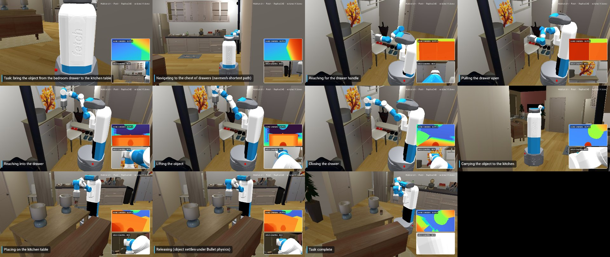

# Fetch: bedroom drawer → kitchen table (Habitat-sim, ReplicaCAD apt_0)



`fetch_bedroom_to_kitchen_1080p.mp4` — 1920×1080, 30 fps, 52 s. **Scripted (non-learned) demo.**

The Fetch mobile manipulator navigates the apartment, opens a chest-of-drawers by its handle,
picks a soup can out of the drawer, closes the drawer, carries the can upright to the kitchen table,
and places it; the can settles under Bullet physics.

## How it works (`src/demo/render_v3.py`)
- **Navigation** — shortest paths on a navmesh recomputed after decluttering (clearance 0.38 m).
- **Arm** — damped-least-squares IK (torso + 7 arm joints) on the simulator's own forward kinematics,
  with approach-axis and finger-axis constraints (side-straddle grasps).
- **Collision-free motion planning** — Bullet contact queries on every robot link and the held object;
  each reach tries a straight Cartesian path, then via-points, then RRT-Connect in joint space with shortcut smoothing.
- **Per-frame collision audit** — every rendered frame is checked; the final render has **0 unplanned contacts**.
- **Placement** — candidate spots are filtered for a clear table surface and a collision-free reach
  (final error 0.9 cm, 0.7° tilt).
- **Camera** — GTA-style chase camera with raycast wall avoidance; PiPs show the hand depth camera
  (mounted where habitat-lab defines Fetch's arm camera) and the head RGB camera.
- Self-check report: `videos/v3/*.checks.json`.

## Reproduce
```bash
vizjob run render     # 720p   (see vizjob.sh; WPI Turing, env /scratch/apatwardhan/envs/habitat)
vizjob run final      # 1080p
```
